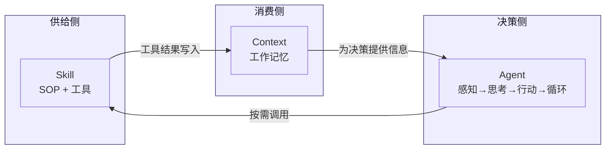

# Agent · 上下文 · Skill —— 三者如何协同工作

> 配套学习资料：`learning-materials/agent.html`、`learning-materials/llm-context.html`、`learning-materials/skill.html`
> 本文件与 `concept-relationship.html` 内容一致：`.md` 版便于在 GitHub 上直接阅读与复用 Mermaid 源码；`.html` 版为自包含网页，含内嵌 SVG 关系图，可直接在浏览器打开。

## 一、三个概念各自是什么

| 概念 | 一句话定义 | 类比 |
| --- | --- | --- |
| **Agent**（智能体） | 能"感知 → 思考 → 行动 → 循环"的自治 AI 实体 | 公司里那位有目标、有权限、能独立把项目做成的"项目经理" |
| **Context**（上下文） | 模型在一次任务中所能"看到"的全部信息：系统提示、历史消息、工具结果、检索片段 | 项目经理桌上的"项目文件夹 + 邮件记录 + 参考资料" |
| **Skill**（技能） | 把任务打包成"指令 + 工具"的、可复用的能力单元 | 项目经理抽屉里一份份标准操作手册（SOP） |

## 二、它们如何相互配合

可以把一个 AI 系统想象成一个人：

```
            ┌────────────────────────────────────────┐
            │              Agent（人）                │
            │                                        │
            │   目标 ←→ 规划 ←→ 决策 ←→ 反思          │
            │     │                │                 │
            │     ▼                ▼                 │
            │  Context         Skill 调用             │
            │ （桌面资料）     （SOP + 工具）          │
            └────────────────────────────────────────┘
```

**1）Context 是 Agent 的"工作记忆"**

- Agent 每一步行动前，都要先组装上下文：系统提示 + 历史对话 + 工具返回值 + 检索片段。
- 没有上下文，Agent 就像失忆的人，不知道之前说过什么、文件写到哪里了。
- **Agent 决定"上下文里放什么"，Context 又约束"Agent 能用什么"。**

**2）Skill 是 Agent 的"专业能力扩展"**

- 没有 Skill 的 Agent 只会"生成文字"，加上 Skill 之后才能"动手做事"（读写文件、查资料、操作 API）。
- Skill 由 Agent 在合适的时机主动调用 → 工具执行 → 结果写回 Context → Agent 再继续思考。
- **Skill 让通用大模型变成"领域专家"，让 Agent 从"对话者"升级为"执行者"。**

**3）三者构成一个完整的智能系统**

> **Agent（决策者）+ Context（记忆载体）+ Skill（行动手册）= 一个能自主完成复杂任务的 AI 系统。**

## 三、一个具体场景示例："帮我做一份统计建模小报告"

| 步骤 | 谁在做事 | 上下文里发生了什么 | 用了哪个 Skill |
| --- | --- | --- | --- |
| ① 接收目标 | Agent | 用户提问进入上下文 | — |
| ② 拆解任务 | Agent | LLM 读取上下文，规划"读数据 → 清洗 → 建模 → 写报告" | — |
| ③ 读数据集 | Skill | 文件内容（CSV/Parquet）写回上下文 | `file-reader` |
| ④ 数据清洗 | Skill | 清洗后的 DataFrame 摘要写回上下文 | `pandas-clean` |
| ⑤ 建模 | Skill | 模型结果（系数 / p 值 / R²）写回上下文 | `statsmodels-run` |
| ⑥ 解读结论 | Agent | LLM 基于充实后的上下文给出文字解释 | — |
| ⑦ 排版报告 | Skill | HTML / PDF 报告写盘 | `doc-typeset` |
| ⑧ 审稿反思 | Agent | 自检输出，发现遗漏 → 回到步骤②再循环 | — |

**关键观察：**

- Agent 是**贯穿全程的"指挥官"**，每一步都要它来决策。
- Context 像**滚雪球**，每轮 Skill 的结果都被吸纳进来，越滚越大。
- Skill 是**临时调用的"专业工种"**，按需出现，用完即走。

## 四、为什么三者缺一不可？

| 缺谁 | 会怎样 |
| --- | --- |
| 没有 Agent | 只有死板的工具调用，没有目标和规划，像一台无人驾驶的机器 |
| 没有 Context | Agent 每一步都"失忆"，任务做不连贯 |
| 没有 Skill | Agent 只会"说话"，不能"做事"，是空想家 |

## 五、设计时的实践建议

1. **设计 Agent 时**：明确它的目标、权限边界、终止条件。
2. **设计 Context 时**：保持关键信息靠前/靠后（避免 Lost in the Middle），及时总结压缩长对话。
3. **设计 Skill 时**：单一职责、触发条件清晰、配套示例齐全。

---

## 六、概念关系图（Mermaid）



> **图说**：Agent 处在决策侧，根据当前 Context 决定下一步调用哪个 Skill；
> Skill 执行后把结果写回 Context；Context 既是 Skill 的输出沉淀，也是 Agent
> 的下一步输入。三者形成"决策 → 执行 → 沉淀 → 再决策"的闭环。

---

> 三者协同的本质：**Agent 做决策，Context 做记忆，Skill 做执行**。把这三者设计好，就能搭出一个真正能用的 AI 应用。